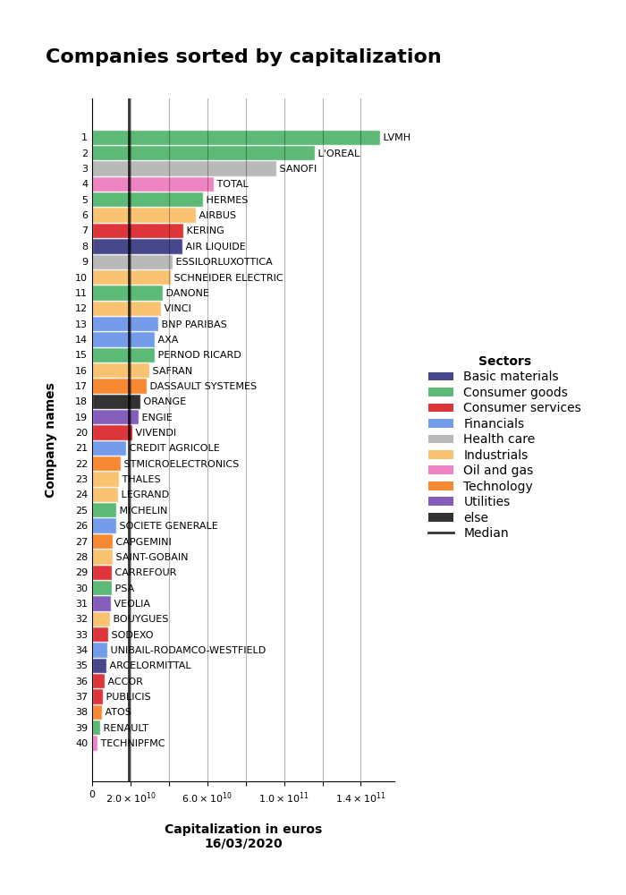

# Catbars

*Simple bars, four features*

##  Example

```python
import pandas as pd
from catbars import Bars
import catbars.cac40

df = pd.DataFrame.from_dict(catbars.cac40.data, 
                            orient = 'index', 
                            columns = ['closing_price', 'cap', 'sector'])

Bars(df['cap'],
     right_labels = df.index,
     left_labels = 'rank',
     colors = df['sector'],
     sort = True,
     line_dic = {'number' : df['cap'].median(),
                 'color' : 'black',
                 'label' : 'Median'},
     title = 'Companies sorted by capitalization',
     legend_title = 'Sectors',
     xlabel = 'Capitalization in euros\n{}'.format(catbars.cac40.date),
     ylabel = 'Company names',
     figsize = (7,10))
```





## Introduction

Catbars is a Python library for making **horizontal** bar charts.

Built on top of [Matplotlib](https://matplotlib.org/api/_as_gen/matplotlib.axes.Axes.barh.html?highlight=barh#matplotlib-axes-axes-barh)
(```barh```), Catbars enables programmers to visualize efficiently
 **labelled observations which can be numerically ordered**.


As a bit of *data science logic* is embedded in Catbars, observations
can be ordered on demand and colors are inferred from labels. You
can override this automatic behaviour by specifying a dictionary
mapping categories to colors. A default color will be used
for the residual categories.

All you have to do is to call the ```Bars``` constructor with the right
keyword arguments (almost everything can be fine-tuned through *kwargs*).

A special attention has been paid to the layout management. Catbars will
do its best to make room for your data (especially for the long labels
on the left **or on the right**) under the constraint of the figure
size (the classic figsize/dpi combination) and the font sizes (data font,
main title font, axis title font).

Catbars will automatically render the figure in Jupyter notebooks
(implicit ```_repr_png_()``` call). The figure can be saved on disk in
png format (by specifying the keyword argument ```file_name``` or by calling
```print_png()``` on the returned object) or in pdf format (```print_pdf()```).

Catbars doesn't support grouped bar charts and stacked bar charts.


## Installation

```python

pip install catbars

```

## Notebooks to explore Catbars

- [Tutorial](../documentation/notebooks/catbars_step_by_step.ipynb)
- [Catbars with real data](../documentation/notebooks/catbars_with_real_data.ipynb)


## License
MIT


